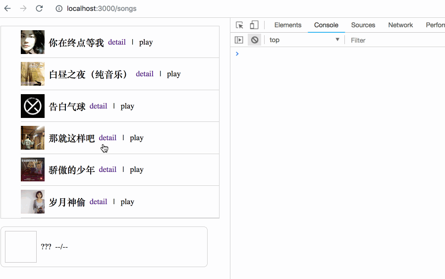

# 借助 Turbolinks 实现不间断的网页音乐播放器

在网页切换时要想实现音乐播放器的不间断播放，常见的有这么几种解决方案：SPA，pajx，iframe。

以上这几种我都没用过，所以今天只介绍我自己在项目中尝试的一种解决方案，用 Turbolinks。这种方案可用于传统的非前后端分离的网站。

## Demo

项目地址：[GitHub](https://github.com/baurine/uninterrupted-audio-player)

音乐和图片来自 [hey-Audio](https://github.com/EryouHao/hey-Audio)，感谢！

> 歌曲是从网易云音乐 mp3 地址转换所得。歌曲信息仅供交流欣赏。网易云音乐仅供试听，不可用作商用。

## Notes

### Turbolinks

先来了理解一下 [Turbolinks](https://github.com/turbolinks/turbolinks) 技术，它是 Rails 项目中自带的一项技术，但应该也可以用于其它后端语言中，因为它就是一个 JavaScript 的库嘛 (但后端也有一点相应的逻辑，后面会讲到)。

一句话概括它的作用，就是接管所有的 `<a>` 标签 (除非显式声明不需要) 的点击事件，点击后，将默认的 html 请求变成 ajax 请求。实际上将一个传统网站变成了接近 SPA，但又基本不改变你原来的写法，极低的侵入性。

那好处是什么呢，我们来进行一些对比。

在没有 Turbolinks 的情况下，我们在页面 A 中点击一个 `<a>` 链接 (假设是页面 B)，浏览器将发起一个常规的 html 请求，从服务器获取页面 B 的 html 代码，然后解析这个 html 代码中包含的 JavaScript/CSS/Assets 的文件，下载，并解析 JavaScript 代码并执行，显示页面 B。

一般来说，页面 A 和 B 的 html head 代码是相同的，意味着包含的 JavaScript/CSS 也是一样的，这些文件在页面 A 加载时已经下载过了，并被浏览器所缓存，所以加载页面 B 时，重新下载可能耗时不会太长，但重新解析 JavaScript 也会消耗一些时间 (有待 profile)。

但是，即使重新下载和解析 JavaScript/CSS 的时间不会太长，但还有一个问题，页面 A 的内存状态无法保持到页面 B。当页面 B 替换页面 A 时，页面 A 在内存中的数据会被完全清空。举个例子，在页面 A 的 JavaScript 代码中，我保存了一个全局变量 `window.globalA = 'haha'`，当页面 B 加载时，这个值就被清除了。

或许你觉得我们可以用 cookie 或 localStorage 将页面 A 的一些状态传递到页面 B，在大部分情况下是可以的，但对于我们想实现的音频的不间断播放，是不行的。

而 Turoblinks 可以解决上面三个问题。当点击 `<a>` 链接时，它将发起一个 ajax 请求，从服务器获取 html 代码，然后解析它的 head 部分，如果 head 和当前页面相同，那么：

1. 不会重新下载 JavaScript/CSS/Assets
1. 不会重新解析 JavaScript/CSS
1. 不会清除当前页面的内存

(不完全精确，但大体逻辑是这样的。)

来看两张截图。

第一张截图是在没有使用 Turoblinks 的情况下，每次点击链接，都会重新下载各种资源。

第二张截图是在使用了 Turbolinks 的情况下，点击链拉后，不会重新下载各种已经下载过的资源。

在 Rails 项目中 Turbolinks 是默认使用的，如果你不想用它，就把它从 application.js 中去掉。

    // app/assets/javascripts/application.js
    //= require rails-ujs
    //= require activestorage
    //= require turbolinks      // ---> remove this line
    //= require_tree .

### 实现

首先我用 Rails + React + webpacker + react-rails 实现一个常规的服务端渲染的非前后端分离的网站。如果你好奇怎么实现的，可以看这个链接 - [在 Rails 中使用 React 并实现 SSR 的一种实践](https://github.com/baurine/react-in-rails-practice)。当然，你也可以不用 React，我这里只阐述一种思想。

如最开头的截图动画所示，这个网站有两个页面，一个页面是歌曲列表，一个页面是单首歌曲的详情页，在这两个页面的底部都有一个音乐播放器。点击任何一首歌曲的 play 按钮，将播放这首歌，且页面间切换时，我期望播放器不会出现任何间断。

实现极其简单，因为 Turbolinks 可以帮助我们在切换页面时保持内存状态，因此我们只需要把 audio element 和当前状态保存到 window 全局对象中即可，跳转到新页面后再读取出来，that's all。

AudioPlayer 的代码如下：

    componentDidMount() {
      if (!window._globalAudioEl) {
        window._globalAudioEl = document.createElement('audio')
      }
      this.audioElement =  window._globalAudioEl

      this.audioElement.addEventListener('canplay', this.onCanPlay)
      this.audioElement.addEventListener('play', this.onPlay)
      this.audioElement.addEventListener('pause', this.onPause)

      window.addEventListener('play-audio', this.playAudioEventHandler)

      // recover state
      if (window._globalAudioState) {
        this.setState(window._globalAudioState, () => {
          this.state.playing && this._setInterval()
        })
      }
    }

    componentWillUnmount() {
      // save current state to window before it is unmounted
      window._globalAudioState = this.state

      window.removeEventListener('play-audio', this.playAudioEventHandler)

      this._clearInterval()

      this.audioElement.removeEventListener('canplay', this.onCanPlay)
      this.audioElement.removeEventListener('play', this.onPlay)
      this.audioElement.removeEventListener('pause', this.onPause)

      // don't pause it
      // this.audioElement.pause()
      this.audioElement = null
    }

### 特殊情况

因为 Turbolinks 只能处理 `<a>` 链接，而且 Turbolinks 将 click event listener 绑定在最顶层的 window 对象上，而不是直接在 `<a>` 上，所以以下几种情况 Turbolinks 无法处理：

1. 如果在 `<a>` 的 click handler 中执行了 `event.stopPropagation()`，阻止了事件冒泡，Turbolinks 将无法接收到此事件
1. 通过表单 Form 发起的 GET 请求
1. 通过表单 Form 发起的 POST 请求

我们得想办法解决它们。

先来看第一种情况，在调用 `event.stopPropagation()` 阻止了事件冒泡后，请求将变回默认的 html 请求，我们可以调用 `event.preventDefault()` 阻止默认操作，并调用 `Turbolinks.visit(url)` API 手动发出 ajax 请求。

代码：

    songClick1 = (e) => {
      // will stop event propagate to window, so turbolinks can't handle this link
      e.stopPropagation()
    }

    songClick2 = (e) => {
      e.stopPropagation()

      e.preventDefault()
      window.Turbolinks.visit(e.target.getAttribute('href') + '?click')
    }

    This link execute event.stopPropagation() :
    <a href={`/songs/${firstSong.id}`}
       onClick={this.songClick1}>
      {firstSong.title}
    </a>

    Resolution :
    <a href={`/songs/${firstSong.id}`}
       onClick={this.songClick2}>
      {firstSong.title}
    </a>

效果对比：

这里面有一个细节，`event.stopPropagation()` 导致 Turoblinks 失效，你会觉得是理所当然的事情，但实际它阻止的是 React 合成事件 (SytheticEvent) 的冒泡，而不是原生事件 (NativeEvent) 的冒泡，而 Turbolinks 处理的是原生事件。如果你想了解原因，可以看这篇文章 - [从 Dropdown 的 React 实现中学习到的](http://baurine.github.io/2018/09/12/learn-from-react-dropdown.html)。

第二种情况，通过表单 Form 发起的 GET 请求，此例中我们创建了一个搜索表单，通过 title 搜索相应的歌曲。

有两种解决办法：

1. 像上面一样，在 Form 的 onSubmit 事件中，调用 `event.preventDefault()` 阻止默认提交，然后调用 `Turbolinks.visit(url)` API 手动发送 ajax 请求。
1. 将 GET 类型的 Form 转换成 `<a>` 链接

示例代码：

    queryUrl = () => {
      return `/songs?q=${this.state.queryStr}`
    }

    submitQuery = (e) => {
      e.preventDefault()
      window.Turbolinks.visit(this.queryUrl())
    }

    render() {
      ...
          
Speical Case 2 - Get Form

          Origin Get Form :
          <form action='/songs'>
            <input type='text' name='q' placeholder='song title'></input>
            <input type='submit' value='search'></input>
          </form>

          Resolution 1 : use window.Turoblinks.visit API
          <form action='/songs' onSubmit={this.submitQuery}>
            <input type='text'
                   placeholder='song title'
                   value={this.state.queryStr}
                   onChange={e=>this.setState({queryStr:e.target.value})}></input>
            <input type='submit' value='search'></input>
          </form>

          Resolution 2 : convert form to link
          

            <input type='text'
                   placeholder='song title'
                   value={this.state.queryStr}
                   onChange={e=>this.setState({queryStr:e.target.value})}></input>
            <a href={this.queryUrl()}>search</a>
          

      ...
    }

效果对比：

再来看第三种情况，通过表单 Form 发起的 POST 请求，此例中我们创建了一个修改歌曲 title 的表单。解决办法异常简单，但背后的原理却值得一说。

先来看解决办法，只有一行代码，在 form 的属性中加上 `data-remote` (或者 `date-remote={true}`)。整体代码如下：

    Resolution: data-remote Form
    <form action={`/songs/${firstSong.id}`} data-remote method='post'>
      <input type="hidden" name="_method" value="put"></input>
      <input type='text'
             name='title'
             placeholder='new song title'
             defaultValue={firstSong.title}>
      </input>
      <input type='submit' value='update'></input>
    </form>

来看一下效果对比：

为什么加了个 `data-remote` 属性就 ok 了呢，是不是很神奇的感觉。这里还有另外一个 JavaScript 库起了作用，rails-ujs，也是 rails 默认启用的。这个库有挺多功能的，在这里的作用是，将所有 `data-remote` 属性为 true 的 form 表单的请求转换成 ajax 请求 (xhr 即表示请求为 ajax)，但注意，此时 Turbolinks 并没有参与，还记得前面说的吗，它只管 `<a>` 链接，其它的一概不关心。

但是，这仅仅解决了第一步，一般来说，POST 请求的结果都是一个 302 响应，浏览器要从响应头中取出目标地址并访问这个新的地址。

这里服务端的代码：

    # songs_controller.rb
    def update
      @song = Song.find params[:id]
      @song.update(title: params[:title])
      redirect_to @song
    end

这里常规的 POST 请求的响应：

如果我们的 ajax 请求得到的也是这种响应，那么跳转无法自动实现。所幸的是，Rails 很智能，它如果检测到 POST 请求是 ajax 发起的，且 Turbolinks 启用，在 `redirect_to @song` 中，它将不再返回 302，而是返回一段 JavaScript 代码：

    Turbolinks.clearCache()
    Turbolinks.visit("http://localhost:3000/songs/21", {"action":"replace"})

ajax 请求得到这个响应后，因为响应类型是 text/javascript，因此它会执行这段 JavaScript 代码，而这段 JavaScript 调用了 Turoblinks 的 visit API，而这个 API 我们前面已经用过数次了，它实际调用 HTML5 history API 实现无刷新的跳转。

这也是前面所说 Turbolinks 虽然是一个 JavaScript 库，但也是需要后端的一些配合的。
